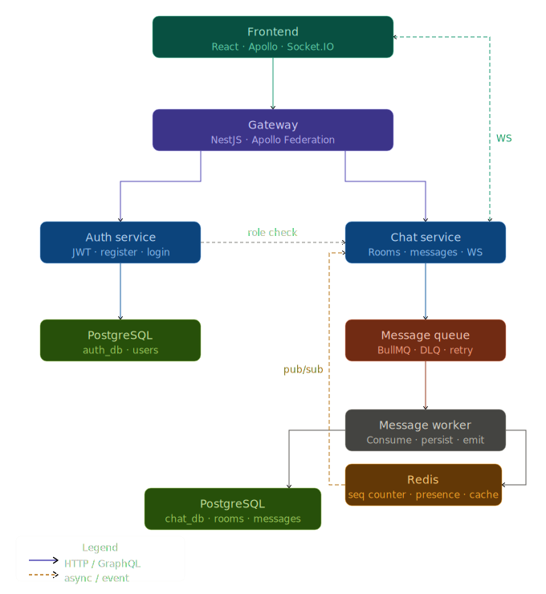

## Case 1
### 1. Gambarkan high-level architecture

---
### 2. a. Sync (GraphQL) vs Async (Message Queue)
Sync (GraphQL) digunakan ketika:
- Frontend membutuhkan response langsung (login, register, fetch rooms, fetch messages)

Async (Message Queue / BullMQ) digunakan ketika:
- Operasi yang tidak perlu hasil langsung - backend kirim response langsung ke frontend dan menandakan proses berlangsung di background (contohnya, worker consume job secara terpisah dari request lifecycle)
- Melindungi database dari spike traffic dengan menggunakan queue untuk menyerap lonjakan request sehingga API selalu respond cepat
- Butuh retry otomatis jika gagal (3 attempts, exponential backoff, DLQ)
---
### 2. b. Alur kirim pesan dari user → agent
- user kirim pesan melalui frontend
- frontend kirim pesan ke gateway
- gateway kirim pesan ke chat service
- Chat Service publish job ke BullMQ queue
- Message Worker consume job dari queue
- Worker INSERT message ke PostgreSQL and publish ke Redis channel
- chat service that subscibe to redis channel will send the message to frontend based on targeted user
---
### 3. a. Apakah chat message disimpan langsung ke PostgreSQL atau lewat queue dulu? 
- melalui queue dulu, di project ini saya menggunakan bullmq dikarenakan bullmq base nya memakai redis
### 3. a. Kenapa? 
- alasan utama nya untuk menghindari write spike ke database dan retry otomatis
---
### 4. a. Bagaimana cara kamu: Menjaga ordering message
menggunakan redis increment yang bersifat atomic, value dari redis increment ini digunakan sebagai order field di dalam message
### 4. b. Mencegah duplicate message
menggunakan message queue (bullmq) dengan jobId yang diisi idempotencykey dan menggunakan database unique constraint menggunakan idempotencykey yang dimana ketika conflict insert do nothing
### 4. c. Handle retry dan  failure 
menggunakan konfigurasi bawaan message queue (bullmq) dan ketika retry gagal sebanyak n kali, maka message dipindahkan ke DLQ (dead letter queue)

## Case 5
### Kenapa API tidak langsung insert ke DB?
alasan utama nya untuk menghindari write spike ke database dan retry otom atis
### Trade-Off async vs sync?
- Async (konteksnya menggunakan message queue)
response time selalu cepat, menyerap lonjakan traffic, dan mencegah duplikasi namun memiliki kompleksitas tinggi
- sync (konteknya graphql) response time bergantung ke database, namun data sudah pasti disimpan ketika user menerima response
### Apa yang kamu lakukan jika : Message queue down 
- jika urgent dan butuh immediate response, langsung insert data ke database
- namun jika tidak, maka cek DLQ dan queue ulang job yang gagal
- untuk pencegahan dapat menggunakan redis sentinel atau cluster
### Apa yang kamu lakukan jika : Database latency naik
- cek query log untuk mengetahui query mana saja yang lambat
- menggunakan EXPLAIN ANALYZE untuk mengecek query plan dari database nya
- cek kolom yang sering di query apakah sudah menggunakan index
- scale up connection pool kalau log menunjukan error connection limit
- untuk pencegahan, 
dapat menggunakan master and slave database
menggunakan redis cache untuk request sering diapakai namun jarang diupdate
pgbouncer untuk connection pooling
set query timeout agar tidak bloking
### Jika tim kecil, apa yang kamu tidak akan serahkan ke engineer member?
- akses ke prod (database, deployment, maupun secret keys dan environment variable, maupun konfigurasi infrastructur)
- merge langsung ke master/staging branch (harus menggunakan PR)
### Dead Letter Queue: Kapan message masuk DLQ?
- ketika job gagal diproses setelah semua attempts habis
### Dead Letter Queue: Siapa yang monitor DLQ?
- engineer on-call atau engineer yang owning service tersebut
### Dead Letter Queue: Apa tidakan setelah message masuk DLQ?
- melihat isi job payload dan error message di log untuk mengecek root cause nya
- fix root cause sebelum melakukan retry job, kalau hanya masalah db down, bisa melakukan retry job dengan aman
### Ordering: Strategi yang dipilih
- menggunakan redis increment sebagai value order indicator dan di simpan dalam table
### Ordering: Kenapa tidak memilih strategi lain? 
- redis increment atomic, jadi bisa dijamin tidak ada pesan yang memiliki order value yang sama
### Ordering: Apa konsekuensinya saat traffic naik 10x?
- redis increment sangat ringan, jadi meskipun  naik 10x, masih jauh di bawah limit redis
### Failure Scenario: DB down 5 menit
- worker gagal INSERT meskipun menggunakan job retry, maka pesan masuk ke DLQ dan tidak hilang, user masih bisa kirim pesan namun tidak mendapatkan history chat ketika refetch
- solusi: read dari replica database (slave), stop worker, sehingga tidak terjadi retry terus menerus
- recovery: queue ulang job yang ada di DLQ
### Failure Scenario: Message Queue backlog 1 juta message
- worker tidak bisa mengimbangi 1 juta pesan yang masuk, sehingga pesan menjadi delay
- solusi: menambah instance worker (semua share queue yang sama) dan worker concurency (dari default ke lebih tinggi
  sesuai DB connection pool limit)
### Failure Scenario: Consumer crash
- job yang sedang diproses ketika crash akan kembali ke queue sehingga tetap aman
- solusi: multiple worker instance dan docker restart policy (restart otomatis ketika crash)